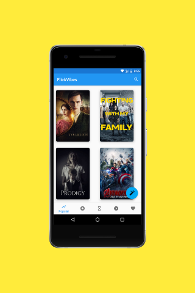
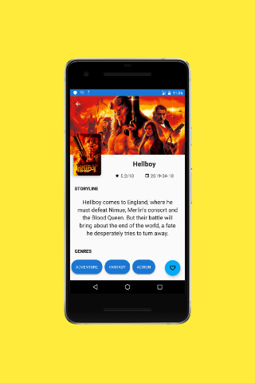

## FlickVibes

FlickVibes is an android application that suggests movies to users based on their feelings. Most of the people tend to watch movies when they are feeling bored, depressed or a multitude of other feelings. This app uses emotion recognition APIs to detect the user's feelings and recommend movies based on their feelings. Users can view most-popular, top-rated and upcoming movies and also bookmark movies. This app allows users to view trailers, ratings, reviews and cast of a selected movie.

## Features
* This app uses emotion recognition APIs to detect user’s feelings.
* This app suggests movies based on the user's feelings.
* Browse the most popular movie list.
* Browse the new releases movie list.
* Browse the top rated movie list.
* Bookmark movies to create your own collection of favourite movies.
* Search for movies, genre, etc.
* Widgets to display info about movies in home screen.

## ScreenShots
&ensp;
&ensp;
&ensp;
&ensp;

## Architecture

* [Model View ViewModel(MVVM)](https://developer.android.com/jetpack/docs/guide)
## Libraries Used

* [Glide](https://bumptech.github.io/glide/)
* [Room Persistent Library](https://developer.android.com/topic/libraries/architecture/room)
* [LiveData](https://developer.android.com/topic/libraries/architecture/livedata)
* [ViewModel](https://developer.android.com/topic/libraries/architecture/viewmodel)
* [Gson](https://github.com/google/gson/)
* [ExoPlayer](https://github.com/google/ExoPlayer/)
* [Retrofit](https://square.github.io/retrofit/)
* [Espresso](https://developer.android.com/training/testing/espresso)
* [Stetho](http://facebook.github.io/stetho/)
* [ExpandableTextView](https://github.com/Blogcat/Android-ExpandableTextView)
* [ButterKnife](http://jakewharton.github.io/butterknife/)
* [FireBase-ML-VISION](https://firebase.google.com/docs/ml-kit)
* [FireBase-Cloud-Messaging](https://firebase.google.com/docs/cloud-messaging)

